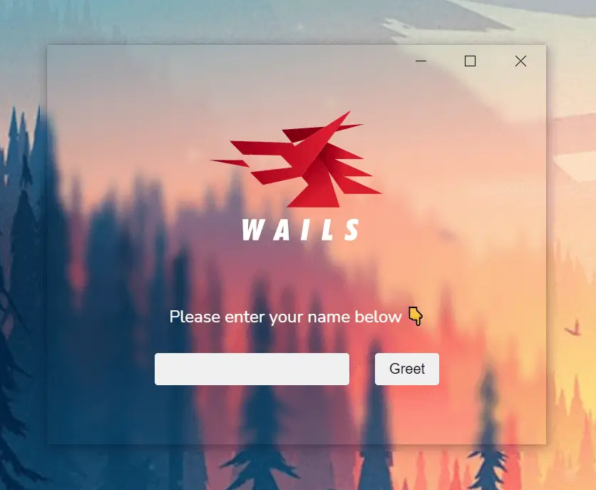
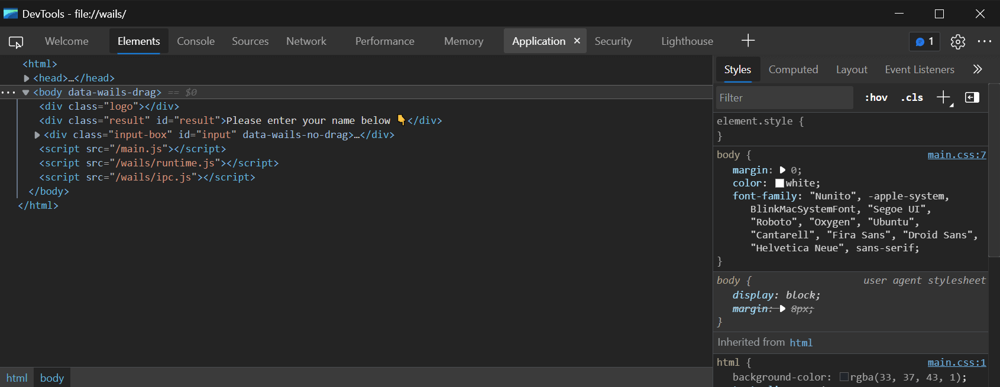
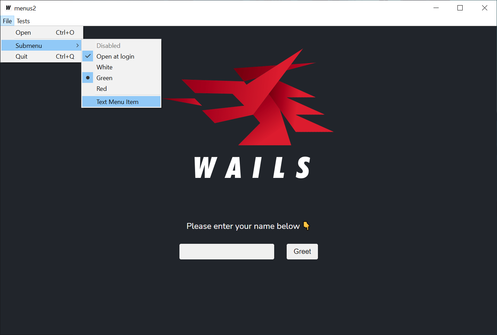
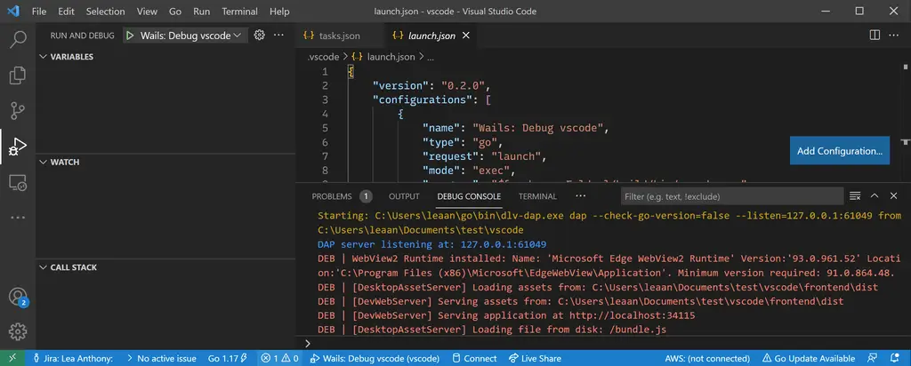
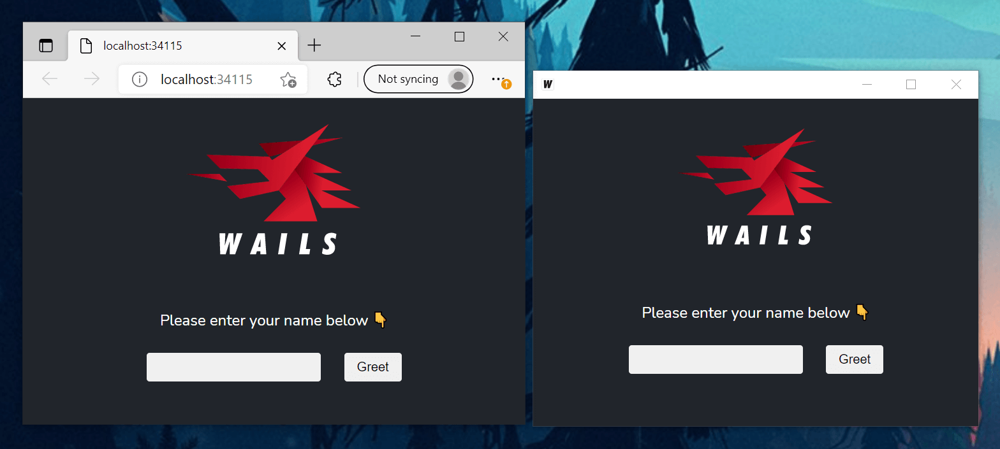
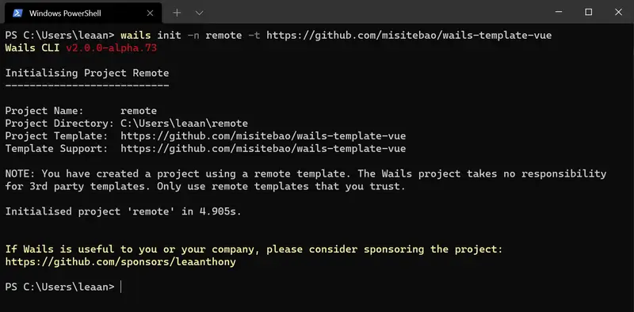

When I first announced Wails on Reddit, just over 2 years ago from a train in
Sydney, I did not expect it to get much attention. A few days later, a prolific
tech vlogger released a tutorial video, gave it a positive review and from that
point on, interest in the project has skyrocketed.

It was clear that people were excited about adding web frontends to their Go
projects, and almost immediately pushed the project beyond the proof of concept
that I had created. At the time, Wails used the
[webview](https://github.com/webview/webview) project to handle the frontend,
and the only option for Windows was the IE11 renderer. Many bug reports were
rooted in this limitation: poor JavaScript/CSS support and no dev tools to debug
it. This was a frustrating development experience but there wasn't much that
could have been done to rectify it.

For a long time, I'd firmly believed that Microsoft would eventually have to
sort out their browser situation. The world was moving on, frontend development
was booming and IE wasn't cutting it. When Microsoft announced the move to using
Chromium as the basis for their new browser direction, I knew it was only a
matter of time until Wails could use it, and move the Windows developer
experience to the next level.

Today, I am pleased to announce: **Wails v2 Beta for Windows**! There's a huge
amount to unpack in this release, so grab a drink, take a seat and we'll
begin...

### No CGO Dependency!

No, I'm not joking: _No_ _CGO_ _dependency_ 🤯! The thing about Windows is that,
unlike MacOS and Linux, it doesn't come with a default compiler. In addition,
CGO requires a mingw compiler and there's a ton of different installation
options. Removing the CGO requirement has massively simplified setup, as well as
making debugging an awful lot easier. Whilst I have put a fair bit of effort in
getting this working, the majority of the credit should go to
[John Chadwick](https://github.com/jchv) for not only starting a couple of
projects to make this possible, but also being open to someone taking those
projects and building on them. Credit also to
[Tad Vizbaras](https://github.com/tadvi) whose
[winc](https://github.com/tadvi/winc) project started me down this path.

### WebView2 Chromium Renderer

Finally, Windows developers get a first class rendering engine for their
applications! Gone are the days of contorting your frontend code to work on
Windows. On top of that, you get a first-class developer tools experience!

The WebView2 component does, however, have a requirement to have the
`WebView2Loader.dll` sitting alongside the binary. This makes distribution just
that little bit more painful than we gophers are used to. All solutions and
libraries (that I know of) that use WebView2 have this dependency.

However, I'm really excited to announce that Wails applications _have no such
requirement_! Thanks to the wizardry of
[John Chadwick](https://github.com/jchv), we are able to bundle this dll inside
the binary and get Windows to load it as if it were present on disk.

Gophers rejoice! The single binary dream lives on!

### New Features

There were a lot of requests for native menu support. Wails has finally got you
covered. Application menus are now available and include support for most native
menu features. This includes standard menu items, checkboxes, radio groups,
submenus and separators.

There were a huge number of requests in v1 for the ability to have greater
control of the window itself. I'm happy to announce that there's new runtime
APIs specifically for this. It's feature-rich and supports multi-monitor
configurations. There is also an improved dialogs API: Now, you can have modern,
native dialogs with rich configuration to cater for all your dialog needs.

There is now the option to generate IDE configuration along with your project.
This means that if you open your project in a supported IDE, it will already be
configured for building and debugging your application. Currently VSCode is
supported but we hope to support other IDEs such as Goland soon.

### No requirement to bundle assets

A huge pain-point of v1 was the need to condense your entire application down to
single JS & CSS files. I'm happy to announce that for v2, there is no
requirement to bundle assets, in any way, shape or form. Want to load a local
image? Use an `` tag with a local src path. Want to use a cool font? Copy
it in and add the path to it in your CSS.

> Wow, that sounds like a webserver...

Yes, it works just like a webserver, except it isn't.

> So how do I include my assets?

You just pass a single `embed.FS` that contains all your assets into your
application configuration. They don't even need to be in the top directory -
Wails will just work it out for you.

### New Development Experience

Now that assets don't need to be bundled, it's enabled a whole new development
experience. The new `wails dev` command will build and run your application, but
instead of using the assets in the `embed.FS`, it loads them directly from disk.

It also provides the additional features:

- Hot reload - Any changes to frontend assets will trigger and auto reload of
  the application frontend
- Auto rebuild - Any changes to your Go code will rebuild and relaunch your
  application

In addition to this, a webserver will start on port 34115. This will serve your
application to any browser that connects to it. All connected web browsers will
respond to system events like hot reload on asset change.

In Go, we are used to dealing with structs in our applications. It's often
useful to send structs to our frontend and use them as state in our application.
In v1, this was a very manual process and a bit of a burden on the developer.
I'm happy to announce that in v2, any application run in dev mode will
automatically generate TypeScript models for all structs that are input or
output parameters to bound methods. This enables seamless interchange of data
models between the two worlds.

In addition to this, another JS module is dynamically generated wrapping all
your bound methods. This provides JSDoc for your methods, providing code
completion and hinting in your IDE. It's really cool when you get data models
auto-imported when hitting tab in an auto-generated module wrapping your Go
code!

### Remote Templates

Getting an application up and running quickly was always a key goal for the
Wails project. When we launched, we tried to cover a lot of the modern
frameworks at the time: react, vue and angular. The world of frontend
development is very opinionated, fast moving and hard to keep on top of! As a
result, we found our base templates getting out of date pretty quickly and this
caused a maintenance headache. It also meant that we didn't have cool modern
templates for the latest and greatest tech stacks.

With v2, I wanted to empower the community by giving you the ability to create
and host templates yourselves, rather than rely on the Wails project. So now you
can create projects using community supported templates! I hope this will
inspire developers to create a vibrant ecosystem of project templates. I'm
really quite excited about what our developer community can create!

### In Conclusion

Wails v2 represents a new foundation for the project. The aim of this release is
to get feedback on the new approach, and to iron out any bugs before a full
release. Your input would be most welcome. Please direct any feedback to the
[v2 Beta](https://github.com/wailsapp/wails/discussions/828) discussion board.

There were many twists and turns, pivots and u-turns to get to this point. This
was due partly to early technical decisions that needed changing, and partly
because some core problems we had spent time building workarounds for were fixed
upstream: Go’s embed feature is a good example. Fortunately, everything came
together at the right time, and today we have the very best solution that we can
have. I believe the wait has been worth it - this would not have been possible
even 2 months ago.

I also need to give a huge thank you :pray: to the following people because
without them, this release just wouldn't exist:

- [Misite Bao](https://github.com/misitebao) - An absolute workhorse on the
  Chinese translations and an incredible bug finder.
- [John Chadwick](https://github.com/jchv) - His amazing work on
  [go-webview2](https://github.com/jchv/go-webview2) and
  [go-winloader](https://github.com/jchv/go-winloader) have made the Windows
  version we have today possible.
- [Tad Vizbaras](https://github.com/tadvi) - Experimenting with his
  [winc](https://github.com/tadvi/winc) project was the first step down the path
  to a pure Go Wails.
- [Mat Ryer](https://github.com/matryer) - His support, encouragement and
  feedback has really helped drive the project forward.

And finally, I'd like to give a special thank you to all the
[project sponsors](/credits#sponsors), including
[JetBrains](https://www.jetbrains.com?from=Wails), whose support drive the
project in many ways behind the scenes.

I look forward to seeing what people build with Wails in this next exciting
phase of the project!

Lea.

PS: MacOS and Linux users need not feel left out - porting to this new
foundation is actively under way and most of the hard work has already been
done. Hang in there!

PPS: If you or your company find Wails useful, please consider
[sponsoring the project](https://github.com/sponsors/leaanthony). Thanks!
