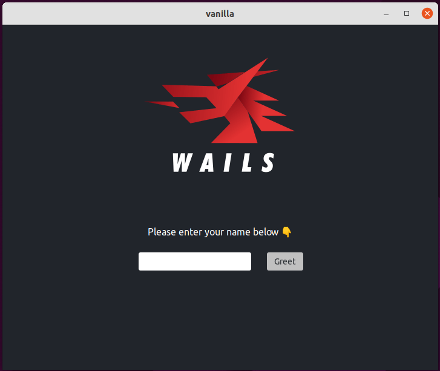
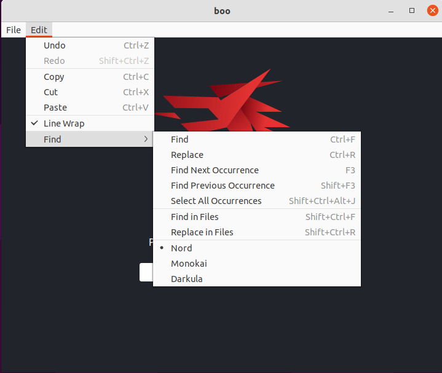
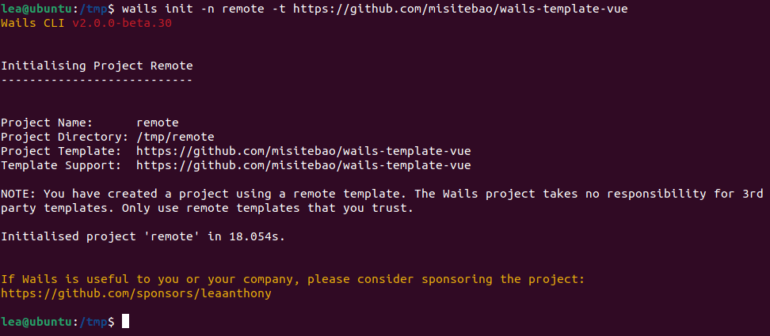
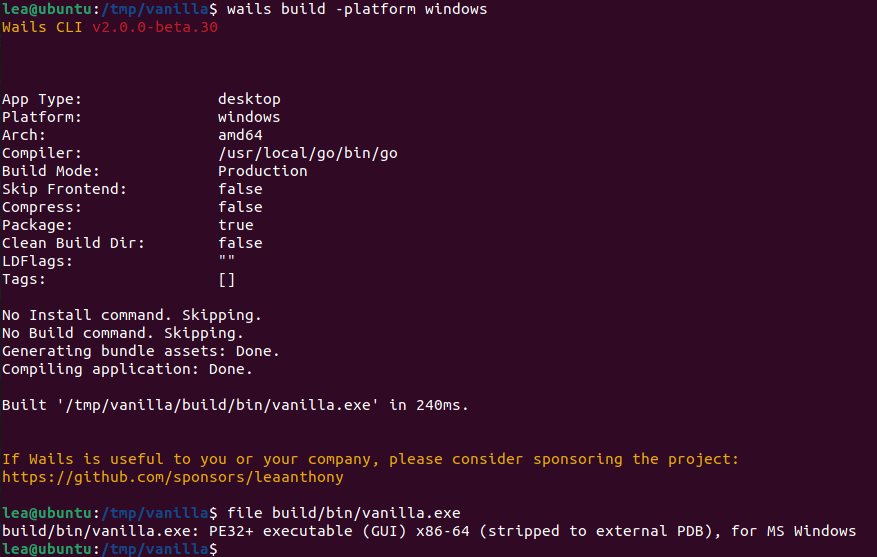

I'm pleased to finally announce that Wails v2 is now in beta for Linux! It is
somewhat ironic that the very first experiments with v2 was on Linux and yet it
has ended up as the last release. That being said, the v2 we have today is very
different from those first experiments. So without further ado, let's go over
the new features:

### New Features

There were a lot of requests for native menu support. Wails has finally got you
covered. Application menus are now available and include support for most native
menu features. This includes standard menu items, checkboxes, radio groups,
submenus and separators.

There were a huge number of requests in v1 for the ability to have greater
control of the window itself. I'm happy to announce that there's new runtime
APIs specifically for this. It's feature-rich and supports multi-monitor
configurations. There is also an improved dialogs API: Now, you can have modern,
native dialogs with rich configuration to cater for all your dialog needs.

### No requirement to bundle assets

A huge pain-point of v1 was the need to condense your entire application down to
single JS & CSS files. I'm happy to announce that for v2, there is no
requirement to bundle assets, in any way, shape or form. Want to load a local
image? Use an `<../../../assets/blog-images>` tag with a local src path. Want to
use a cool font? Copy it in and add the path to it in your CSS.

> Wow, that sounds like a webserver...

Yes, it works just like a webserver, except it isn't.

> So how do I include my assets?

You just pass a single `embed.FS` that contains all your assets into your
application configuration. They don't even need to be in the top directory -
Wails will just work it out for you.

### New Development Experience

Now that assets don't need to be bundled, it's enabled a whole new development
experience. The new `wails dev` command will build and run your application, but
instead of using the assets in the `embed.FS`, it loads them directly from disk.

It also provides the additional features:

- Hot reload - Any changes to frontend assets will trigger and auto reload of
  the application frontend
- Auto rebuild - Any changes to your Go code will rebuild and relaunch your
  application

In addition to this, a webserver will start on port 34115. This will serve your
application to any browser that connects to it. All connected web browsers will
respond to system events like hot reload on asset change.

In Go, we are used to dealing with structs in our applications. It's often
useful to send structs to our frontend and use them as state in our application.
In v1, this was a very manual process and a bit of a burden on the developer.
I'm happy to announce that in v2, any application run in dev mode will
automatically generate TypeScript models for all structs that are input or
output parameters to bound methods. This enables seamless interchange of data
models between the two worlds.

In addition to this, another JS module is dynamically generated wrapping all
your bound methods. This provides JSDoc for your methods, providing code
completion and hinting in your IDE. It's really cool when you get data models
auto-imported when hitting tab in an auto-generated module wrapping your Go
code!

### Remote Templates

Getting an application up and running quickly was always a key goal for the
Wails project. When we launched, we tried to cover a lot of the modern
frameworks at the time: react, vue and angular. The world of frontend
development is very opinionated, fast moving and hard to keep on top of! As a
result, we found our base templates getting out of date pretty quickly and this
caused a maintenance headache. It also meant that we didn't have cool modern
templates for the latest and greatest tech stacks.

With v2, I wanted to empower the community by giving you the ability to create
and host templates yourselves, rather than rely on the Wails project. So now you
can create projects using community supported templates! I hope this will
inspire developers to create a vibrant ecosystem of project templates. I'm
really quite excited about what our developer community can create!

### Cross Compilation to Windows

Because Wails v2 for Windows is pure Go, you can target Windows builds without
docker.

### In Conclusion

As I'd said in the Windows release notes, Wails v2 represents a new foundation
for the project. The aim of this release is to get feedback on the new approach,
and to iron out any bugs before a full release. Your input would be most
welcome! Please direct any feedback to the
[v2 Beta](https://github.com/wailsapp/wails/discussions/828) discussion board.

Linux is **hard** to support. We expect there to be a number of quirks with the
beta. Please help us to help you by filing detailed bug reports!

Finally, I'd like to give a special thank you to all the
[project sponsors](/credits#sponsors) whose support drive the project in many
ways behind the scenes.

I look forward to seeing what people build with Wails in this next exciting
phase of the project!

Lea.

PS: The v2 release isn't far off now!

PPS: If you or your company find Wails useful, please consider
[sponsoring the project](https://github.com/sponsors/leaanthony). Thanks!
